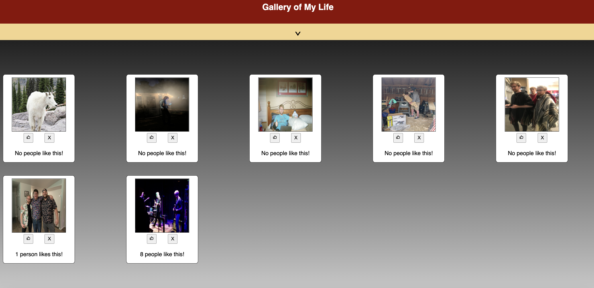
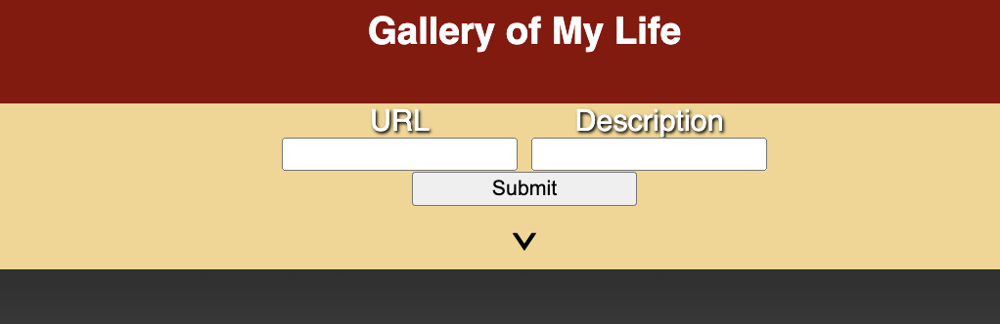
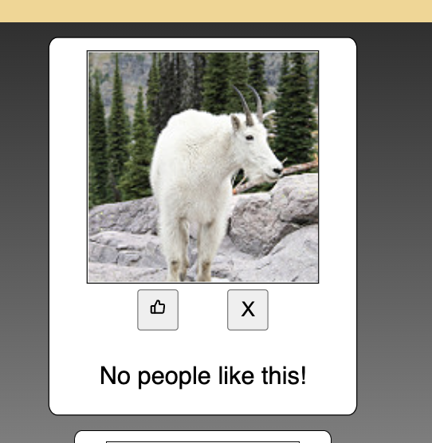
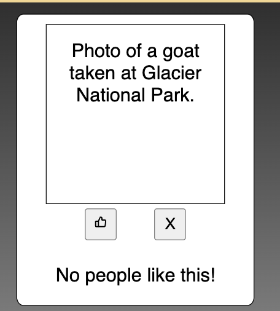
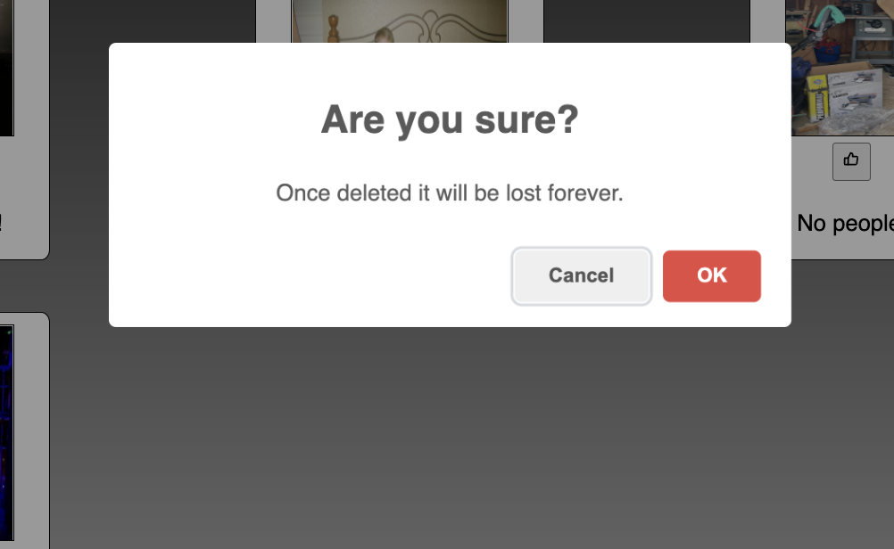

# React Gallery

## Description

_Duration: 2 Day Sprint_

The React Gallery is an app that allows a user to upload an image with a description to the site. The site stores the uploaded information into a database. Users may like a gallery item or delete the item from the list. 

---

---

## Prerequisites

-[node js](https://nodejs.org/en/)

-[npm](https://docs.npmjs.com/)

## Usage

1. The user can upload a photo with a `description` by clicking on the `arrow` underneath the Gallery of My Life header.
    - After filling in both `input` boxes the user can hit the `submit` button to upload the photo.

2. For each `item` / `photo` added, a display card will be added to the gallery.
    - The display card on `hover` will enlarge for clarity.
    - Additionally the user may click on the photo to see the `description`.

3. On each display card there is a `like button` and a `delete button`. 
    - Selecting the `like button` will add a like to the image.
    - Selecting the `delete button` will cause a pop up warning message to confirm before deleting the item.

